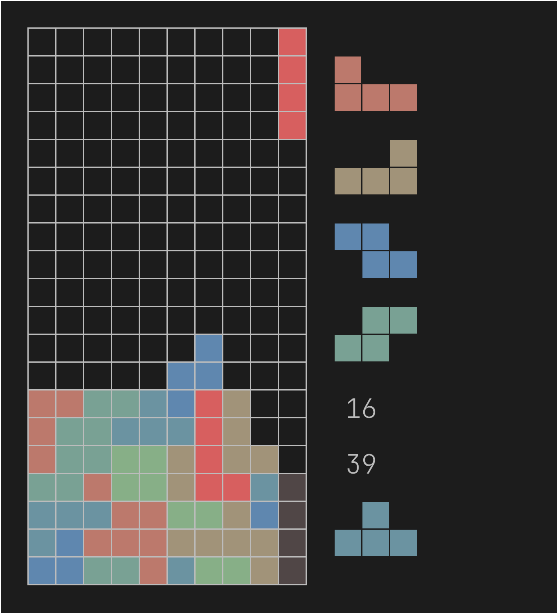

# Zigtris

Any of the following commands will produce a more than decent binary.

```console
zig build -Drelease-safe
zig build -Drelease-small
zig build -Drelease-fast
```

Enjoy!

# Quick showcase



The numbers displayed are lines cleared and time passed respectively.
The game is basically a 40-line sprint in which you can ignore the finish line
and continue playing. Once you clear 40 lines, the time displayed will be the
same for the rest of that session.

# Controls

| Key | Action |
| --- | --- |
| Escape | Quit game |
| Tab | Next colorscheme |
| Backspace | Previous colorscheme |
| R | Reset game (restart) |
| Right Control | Hold piece |
| A | Rotate left |
| D | Rotate spin |
| Up | Rotate right |
| Left | Move left |
| Right | Move right |
| Down | Move down |
| Space | Hard drop |
| {1,2,3} | Switch to {Solid,Gridless,Edges} style drawing respectively |

# Customization

Currently, there are no plans to add a configuration file. However, I am not
entirely opposed to the idea.

In order to customize Zigtris, below are a few helpful pointers.

## Size

Scaling is done automatically based on the window's height. To change the
initial block size, change the `SIZE` variable. This will affect the initial
window size.

## Keys, and the key repeating behavior

In the **Keyboard** structure are two variables, `initial_delay` and
`repeat_delay`. Both are used to determine whether a held down key should
repeat or not. The initial delay waits a number of time units before
activating the repeating behavior. Then the `repeat_delay` is used to determine
the number of keys per time unit.

As per default, they only affect **Left**, **Right**, and **Down** arrow keys.

Look for `SDL_SCANCODE_` to see all the keys and customize to your liking.

## Font

The default is a [JetBrainsMono](https://github.com/JetBrains/JetBrainsMono)
variant. Simply replace `./assets/font.ttf`, then recompile to change it.

## Colors

In-game you can cycle through the colorschemes by pressing **Tab** or
**Backspace**. The default colors are **habamax**, **gruvbox dark**, **gruvbox
light**, **onedark**, and catppuccin **macchiato**. These are all popular
colorschemes used by programmers.

## Style

The drawing style for pieces is very simple. I hope to keep it as simple as
possible, while still having some variety. That said, there is a **Style**
enumeration which could be expanded on.


# Contributions

Feel free to suggest changes.

#
